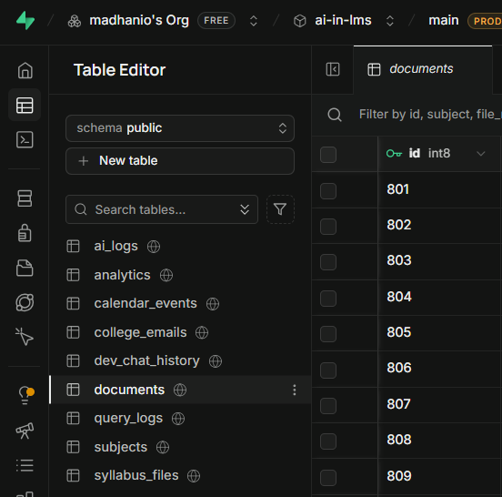
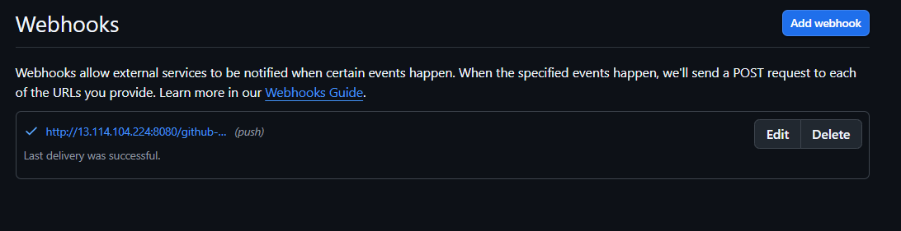
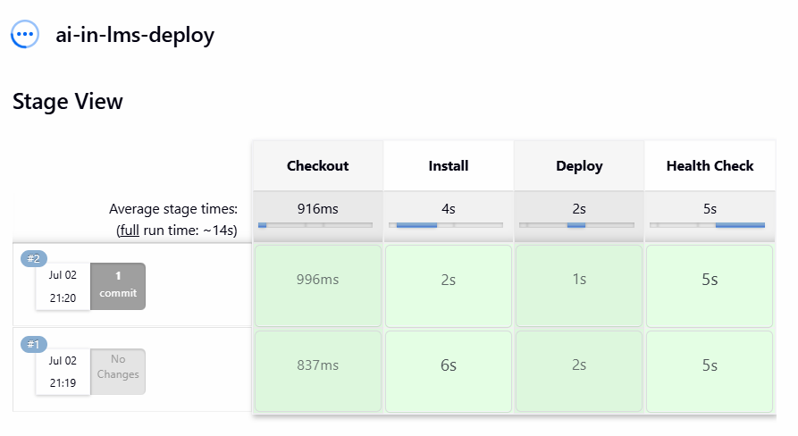
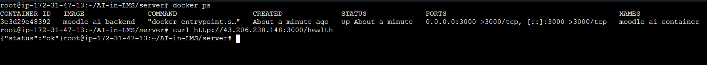

# 🎓 Moodle AI — Academic Mentoring Assistant

A RAG (Retrieval-Augmented Generation) pipeline embedded in a Moodle-integrated LMS that answers student queries using uploaded course materials, streams responses token-by-token via SSE, and delivers them through a Flutter mobile app.

---

## ✅ Key Features

### 🧠 Core RAG & AI Pipeline
- **Smart Q&A Retrieval:** Extracts and vectorizes multi-format course materials (PDF, DOCX) via NVIDIA NIM.
- **Vision-Driven Parsing:** Extracts tabular data and calendars using NVIDIA Vision LLM.
- **Dynamic Query Routing:** Intelligently routes queries between vector search, SQL calendar lookup, and LMS APIs.

### 📱 User & Admin Interfaces
- **SSE Streaming:** Delivers token-by-token stream responses with active source references.
- **Mobile Chat App:** Cross-platform Flutter application with history persistence and markdown formatting.
- **Admin Dashboard:** Simple web UI to upload documents, manage subjects, and configure models.

---

## 🏗 Architecture Flow

1. **Student Query:** Student asks a question via the Flutter application chat screen.
2. **Intent Classification:** Backend classifies query intent (`concept_explanation`, `calendar_query`, or `student_data_query`).
3. **Retrieval Search:** System executes pgvector similarity search, SQL calendar lookup, or LMS API retrieval.
4. **LLM Generation:** NVIDIA NIM LLM synthesizes an answer using the retrieved context.
5. **Client SSE Stream:** Flutter receives token-by-token server-sent events (SSE) and displays them in real-time.

---

## ⚡ Supabase Integration

Supabase acts as the primary data store and vector database, combining relational integrity with vector search capabilities:
- **Course Material Vectors (`pgvector`):** Stores chunked course text mapped to `1024-dimensional` embeddings generated via NVIDIA NIM.
- **Relational Tables:** Manages data for academic subjects, document metadata, logs, and calendar event schedules.

### Database Schema View

---

## 📱 Application Interface

Here is a preview of the student client application interface:

## 🚀 Deployment

Deployed live on **AWS EC2** with a full CI/CD pipeline (GitHub Webhook → Jenkins → pm2).

### CI/CD Pipeline

GitHub push on main triggers a webhook to Jenkins, which runs 6 stages: Checkout Code → Cleanup Docker → Build Docker Image → Remove Old Container → Run Docker Container → Health Check. Full pipeline completes in ~2 minutes.

### Screenshots

**Webhook — Last delivery successful**

**Jenkins Pipeline — 6-stage Docker CI/CD (latest run #11, all green)**

**Docker container live on EC2 — health check confirmed**

### Docker Configuration
The backend runs as a Docker container (`moodle-ai-container`) built from `server/Dockerfile`, exposing port `3000`. Managed via `docker-compose` and orchestrated by Jenkins on every push.
