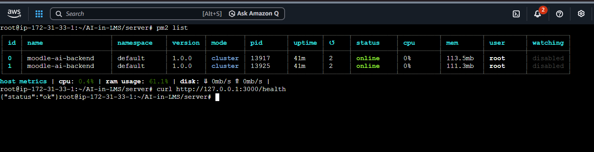

# 🎓 Moodle AI — Academic Mentoring Assistant

A RAG (Retrieval-Augmented Generation) pipeline embedded in a Moodle-integrated LMS that answers student queries using uploaded course materials, streams responses token-by-token via SSE, and delivers them through a Flutter mobile app.

---

## 🛠 Tech Stack

- **Backend:**
  - `Node.js v20+`
  - `Express`
  - `OpenAI SDK`
  - `Supabase (pgvector)`
  - `pdf-parse`
  - `Tesseract.js`
  - `mammoth`
  - `multer`
  - `JWT`
  - `PM2`
- **Models:**
  - `nvidia/nv-embedqa-e5-v5` (embeddings)
  - `meta/llama-3.1-8b-instruct` / `llama-3.1-70b-instruct` (NVIDIA NIM LLM)
- **Frontend:**
  - `Flutter SDK ^3.10.0`
  - `Provider`
  - `Hive (local cache)`
  - `http (SSE client)`
  - `flutter_markdown`
  - `url_launcher`

---


## ✅ Key Features

### 🧠 Core RAG & AI Pipeline
- **Smart Q&A Retrieval:** Extracts and vectorizes multi-format course materials (PDF, DOCX) via NVIDIA NIM.
- **Vision-Driven Parsing:** Extracts tabular data and calendars using NVIDIA Vision LLM.
- **Dynamic Query Routing:** Intelligently routes queries between vector search, SQL calendar lookup, and LMS APIs.
- **Guardrails & Caching:** Enforces Exam Mode restrictions, caches common queries, and validates output to prevent hallucinations.

### 📱 User & Admin Interfaces
- **SSE Streaming:** Delivers token-by-token stream responses with active source references.
- **Mobile Chat App:** Cross-platform Flutter application with history persistence and markdown formatting.
- **Admin Dashboard:** Simple web UI to upload documents, manage subjects, and configure models.

---

## 🏗 Architecture Flow

1. **Student Query:** Student asks a question via the Flutter application chat screen.
2. **Intent Classification:** Backend classifies query intent (`concept_explanation`, `calendar_query`, or `student_data_query`).
3. **Retrieval Search:** System executes pgvector similarity search, SQL calendar lookup, or LMS API retrieval.
4. **LLM Generation:** NVIDIA NIM LLM synthesizes an answer using the retrieved context.
5. **Client SSE Stream:** Flutter receives token-by-token server-sent events (SSE) and displays them in real-time.

---

## ⚡ Supabase Integration

Supabase acts as the primary data store and vector database, combining relational integrity with vector search capabilities:
- **Course Material Vectors (`pgvector`):** Stores chunked course text mapped to `1024-dimensional` embeddings generated via NVIDIA NIM.
- **Relational Tables:** Manages data for academic subjects, document metadata, logs, and calendar event schedules.

### Database Schema View


---

## 📱 Application Interface

Here is a preview of the student client application interface:


## 🚀 Deployment

Deployed live on **AWS EC2** with a full CI/CD pipeline (GitHub Webhook → Jenkins → pm2).

### CI/CD Pipeline

GitHub push on `main` triggers a webhook to Jenkins, which runs: Checkout → npm install → pm2 reload → Health Check. Full pipeline completes in ~14 seconds.

### Screenshots

**Webhook — Last delivery successful**


**Jenkins Pipeline — Stage View (avg ~14s full run)**


**pm2 Cluster — 2 instances online on EC2 + health check confirmed**


### PM2 Configuration

The backend runs in **cluster mode** via `ecosystem.config.cjs`:

```js
module.exports = {
  apps: [{
    name: "moodle-ai-backend",
    script: "./index.js",
    instances: "max",
    exec_mode: "cluster",
    autorestart: true,
    max_memory_restart: "450M",
    env: {
      NODE_ENV: "production",
      PORT: 3000
    }
  }]
};
```

